# Aufgabe 1a

1)  **Installieren Sie Oracle VM VirtualBox (Base Package). VirtualBox läuft auf Windows- Linux- und MacOS-Host. Beachten Sie bitte die Lizenzbedingungen.**
2) **Nutzen Sie VirtualBox, um zwei virtuelle Maschinen aufzusetzen**
3) **Installieren Sie auf diesen beiden virtuellen Maschinen das Linux-Betriebssystem „Ubuntu“**<br>
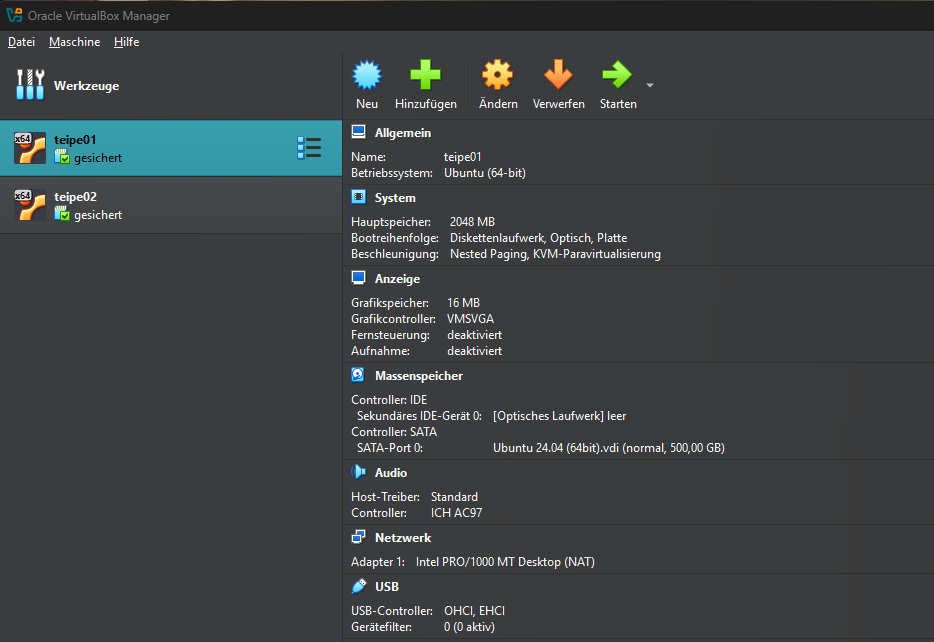

4) **Konfigurieren Sie die beiden virtuellen Maschinen, sodass Folgendes gilt:**<br>
- Die Hostname der beiden virtuellen Maschinen lauten sirm01 und sirm02 (Hostnamen müssen nicht identisch mit den Namen der virtuellen Server unter VirtualBox sein).<br>
  Beim Einrichten den Hostnamen entsprechend über VirtualBox Gui wählen:<br>
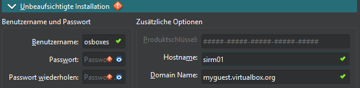<br>

- Die beiden virtuellen Maschinen haben statische IP-Adressen aus dem Netz 10.11.12.0(10.11.12.0/24) erhalten.<br>
  Problem: Host-Netz ist Intern. Also im 192.168.x.x Bereich. Adressen aus dem 10.11.12.x Bereich können nicht direkt verwendet werden, wenn auch noch Internetzugang bestehen soll.<br>
  Lösung: Die VMs brauchen 2 Netzwerkadapter.
  - NAT: Zugriff auf das Internet. VM geht über den Host ins Netz.
  - Host-Only: Kommunikation im geforderten 10.11.12.x Netzwerk (Vom Internet isoliert).
  - Erstellen des Host-Only Netzwerks:<br>
    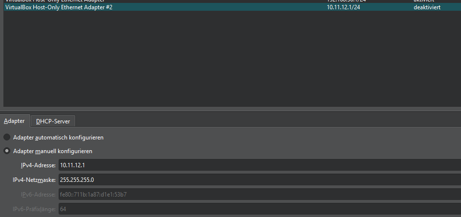
  - Netzwerkadapter beider VMs konfigurieren: <br>
    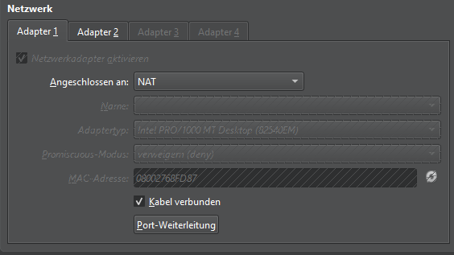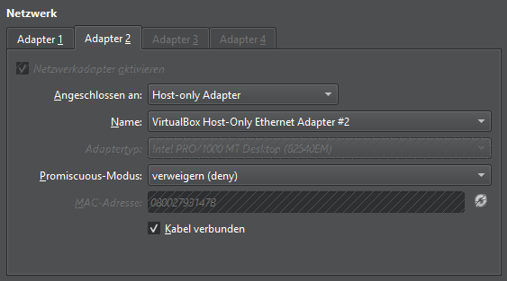
  - Netplan Configs ändern:
    ````yaml
    network:
      version: 2
      ethernets:
        enp0s3:
          dhcp4: true
          nameservers:
            addresses: [8.8.8.8, 1.1.1.1] #DNS-Server zur Sicherheit, falls keiner gefunden wird
        enp0s8:
          dhcp4: false
          addresses: [10.11.12.2/24] #10.11.12.3/24 für sirm02
    ````
- Beide virtuellen Maschinen können mittels IP-Protokoll miteinander kommunizieren.<br>
  Ping von sirm01 auf sirm02: `ping 10.11.12.3`
  Auf sirm02 auf Pakete lauschen: `sudo tcpdump -i any icmp`<br>
  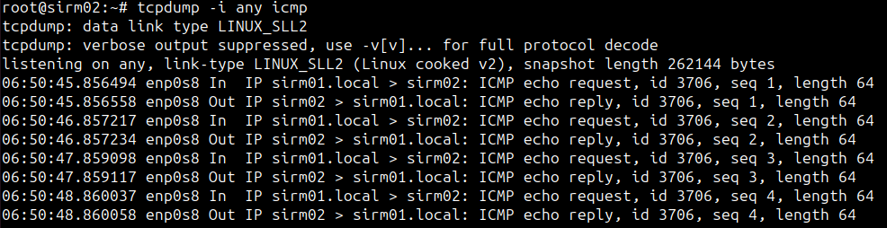
- Beide virtuellen Maschinen haben Zugriff ins Internet.<br>
  Testen, ob ein Ping ins Internet funktioniert: `ping google.com`<br>
  
- Die installierte Software ist auf dem neuesten Stand (gemäß Paketmanager).<br>
  `sudo apt update && sudo apt upgrade`
- Von der einen virtuellen Maschine kann jeweils mittels SSH auf die andere zugegriffen werden. Der Zugriff mittels SSH erfordert keine Angabe eines Passworts.<br>
  Schlüssel generieren: `ssh-keygen`<br>
  Schlüssel kopieren: `ssh-copy-id osboxes@10.11.12.3`<br>
  Testen: `ssh osboxes@10.11.12.3`<br>
  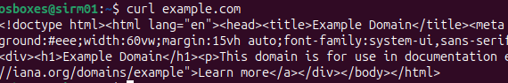

5)**Arbeiten sie mit „Snapshots“ für ihr System:**
- Erstellen Sie nach der Ersteinrichtung einen Snapshot.<br>
  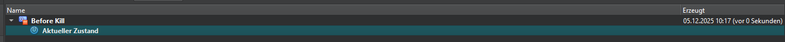
- Finden Sie einen Weg, um ihr Ubuntu-System nachhaltig unbrauchbar zu machen. Dokumentieren Sie Ihren Ansatz.<br>
  Mit `sudo rm -rf /lib/x86_64-linux-gnu/libc.so.6` wird die Zentrale glibc-Laufzeitbibliothek entfernt, mit der sämtliche Binärdateien ausgeführt werden. Die shell selber kann daher auch nicht mehr funktionieren.
- Stellen Sie den alten Stand mittels des Snapshots wieder her. <br>
  Da das Ausschalten der VM nur noch über VirtualBox funktioniert, kann hier direkt der alte Snapshot geladen werden: <br>
  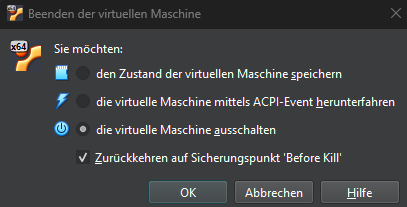
  glibc-Libs sind wieder da: <br>
  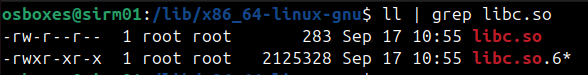

# Aufgabe 1b
Vorarbeiten:
- Installation von VirtualBox
- Download Ubuntu ISO
- Skripte in der PowerShell aktivieren
- VirtualBox Pfad zur Umgebungsvariable `Path` hinzufügen

````powershell
#--- Variablen-Definition ---
$VM_Name    = "teipe"
$Net_Name   = "teipe_net"
$Net_Range  = "10.11.33.0/24"
$ISOPath    = "C:\Users\Nils Teipel\Downloads\ubuntu-24.04.3-live-server-amd64.iso"
$VM_DIR     = "C:\Users\Nils Teipel\VirtualBox VMs"
$DiskPath   = Join-Path $VM_DIR "$VM_Name.vdi"

$RAM        = 4096
$VRAM       = 16
$CPUs       = 2

Write-Host "--- Vorbereitung: Cleanup alter Ressourcen ---" -ForegroundColor Yellow

#1. Cleanup: Falls die VM läuft, ausschalten und löschen (Fehler werden mit 2>$null unterdrückt)
VBoxManage controlvm $VM_Name poweroff 2>$null
VBoxManage unregistervm $VM_Name --delete 2>$null
VBoxManage natnetwork remove --netname $Net_Name 2>$null

Write-Host "--- Starte VM-Erzeugung: $VM_Name ---" -ForegroundColor Cyan

#2. NAT-Netzwerk anlegen für die IP-Adressvergabe
VBoxManage natnetwork add --netname $Net_Name --network $Net_Range --dhcp on

#3. VM registrieren
VBoxManage createvm --name $VM_Name --ostype "Ubuntu_64" --register

#4. Hardware-Parameter setzen und Netzwerkadapter festlegen
VBoxManage modifyvm $VM_Name `
    # --cpus $CPUs `
    # --memory $RAM `
    # --vram $VRAM `
    # --graphicscontroller vmsvga `
    # --nic1 natnetwork `
    # --natnet1 $Net_Name

#5. Virtuelle Festplatte erstellen
VBoxManage createmedium disk --filename $DiskPath --size 20000

#6. Storage-Controller hinzufügen
VBoxManage storagectl $VM_Name --name "SATA_Controller" --add sata --controller IntelAhci
VBoxManage storagectl $VM_Name --name "IDE_Controller" --add ide

#7. Medien (HDD & ISO) einbinden
VBoxManage storageattach $VM_Name --storagectl "SATA_Controller" --port 0 --device 0 --type hdd --medium $DiskPath
VBoxManage storageattach $VM_Name --storagectl "IDE_Controller" --port 0 --device 0 --type dvddrive --medium $ISOPath

#8. Boot-Reihenfolge festlegen
VBoxManage modifyvm $VM_Name --boot1 dvd --boot2 disk

#9. VM starten
VBoxManage startvm $VM_Name --type gui

Write-Host "Erfolgreich! Die VM $VM_Name wird gestartet." -ForegroundColor Green
````
Quelle: Foliensatz + Gemini <br>
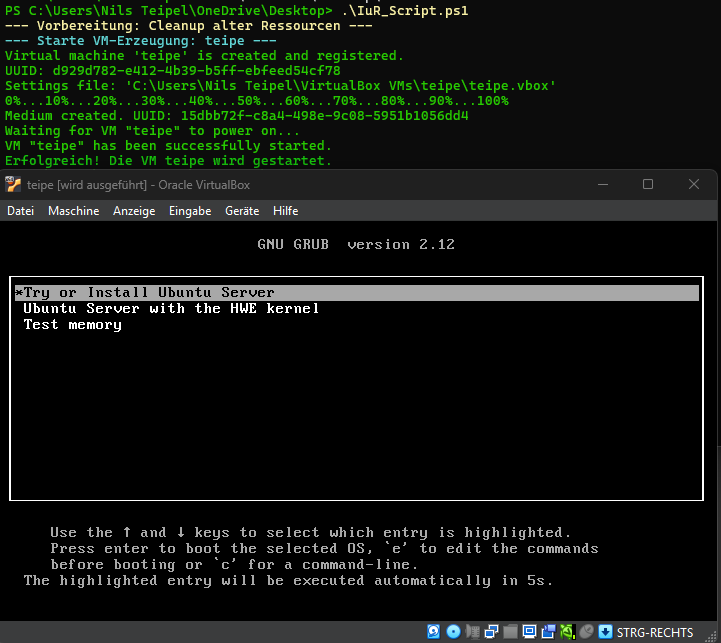
