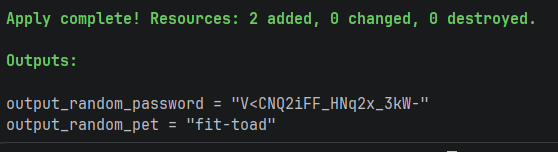

# Aufgabe 2a

**Schauen Sie sich das Modul Random von HashiCorp an (https://registry.terraform.io/providers/hashicorp/random/latest/docs)**
- Schreiben sie eine Terraform-Anwendung, die folgende Werte in der Konsole ausgibt-
- Ein zufälliges Passwort (20 Zeichen lang, Klein- und Großbuchstaben, Zahlen und Sonderzeichen)
- Einen zufälligen Haustiernamen.
- Benutzen sie drei .tf-Dateien: (Quellen in den Source-Files)
- Terraform-Konfiguration (z.B. providers.tf)
````terraform
terraform {
  required_providers {
    random = {
      source = "hashicorp/random"
      version = "3.7.2"
    }
  }
}

provider "random" {
  # Configuration options
}
````
• Ressourcen (z.B. main.tf)
````terraform
resource "random_password" "password" {
  length           = 20
  special          = true
  override_special = "!#$%&*()-_=+[]{}<>:?"
}

resource "random_pet" "pet" {
  length = 2
  separator = "-"
}
````
• Ausgaben (z.B. output.tf)
````terraform
output "output_random_password" {
  value = nonsensitive(random_password.password.result)
}

output "output_random_pet" {
  value = random_pet.pet.id
}
````
• Wichtig: Verzichten sie zur Lösung auf LLMs. Können Sie sich das Passwort in der Konsole anzeigen lassen? Wenn nicht, gibt es einen Weg, dies trotzdem zu erzwingen?
Das Passwort wird mit standardmäßig als `<Sensitive>` angezeigt, aber mit `nonsensitive(<value-expression>)` lassen sich auch sensitive Daten, wie Passwörter anzeigen.<br>



# Aufgabe 2b

**Erstellung sie IaC mittels LLMs**
- Verwenden Sie ein LLM Ihrer Wahl, um mit dem unten angegebenen Prompt eine Infrastruktur für Terraform und AWS zu erstellen.
  - Gewähltes LLM: `ChatGPT`
- Was können Sie bemerken, wenn sie den Prompt mehrfach auf das gleiche Modell (LLM) anwenden?
  - 1 und 2 haben einen modularen Ansatz, bei dem Ressourcen, wie IAM-Rollen, Security Groups und die EC2-Instanz in separate Dateien aufgeteilt wurden
  - 3 hat einen Single-File-Ansatz und fast die gesamte Logik in eine einzige Datei geschrieben.
  - Bei allen drei Iterationen ist die Nutzung der AWS-Ressourcen konsistent.
  - Detailunterschiede, wie Benennung der Variablen und Separation der Variablen.
  - 1 und 2 fragen nach einem EC2-Key-Pair-Namen und 3 fragt nach einer IP für SSH-Zugriff.
- Überführen Sie den Code des LLMs in lokale Dateien, um diesen auf der Festplatte zu speichern und in Terraform ausführen zu können.
  - [firstLLMIteration](code/b/firstLLMIteration)
  - [secondLLMIteration](code/b/secondLLMIteration)
  - [thirdLLMIteration](code/b/thirdLLMIteration) <br>

**Prompt: `I need a Web Service running on an EC2 and I need to send emails via Amazon SNS. Could you provide me with the terraform code`**

**Führen Sie eine Sicherheitsüberprüfung des KI-generierten Codes durch.**
- Insofern die KI IAM-Berechtigungen mittels Policies erstellt hat, überprüfen sie, ob die Policies dem Least-Privilege-Principle entsprechen.
  - Erste Iteration:
    - [iamRoleForEc2Access.tf](code/b/firstLLMIteration/iamRoleForEc2Access.tf): `aws_iam_role` -> Least Privilege
    - [iamRoleForEc2Access.tf](code/b/firstLLMIteration/iamRoleForEc2Access.tf): `aws_iam_policy` -> Least Privilege
  - Zweite Iteration:
    - [iamRoleForEc2.tf](code/b/secondLLMIteration/iamRoleForEc2.tf): `aws_iam_role` -> Leas Privilege
    - [iamRoleForEc2.tf](code/b/secondLLMIteration/iamRoleForEc2.tf): `aws_iam_role_policy` (Inline) -> Least Privilege
  - Dritte Iteration:
    - [main.tf](code/b/thirdLLMIteration/main.tf): `aws_iam_role` -> Least Privilege 
    - [main.tf](code/b/thirdLLMIteration/main.tf): `aws_iam_policy` -> Least Privilege
  - Die EC2-Instanz erhält immer nur den minimal notwendigen Zugriff, um Mails senden zu können.
- Verwenden Sie Checkov, um den Code nach Schwachstellen zu scannen. Werden Schwachstellen gefunden? Wenn ja, beschreiben sie, welche sie als kritisch einordnen würden und warum.
  - .
- Hängen Sie die Ergebnisse des LLMs und von checkov als Datei an ihre Dokumentation an. checkov kann Ergebnisse direkt in eine Datei exportieren (--output-file-path OUTPUT_FILE_PATH).
