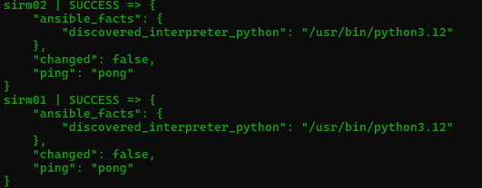
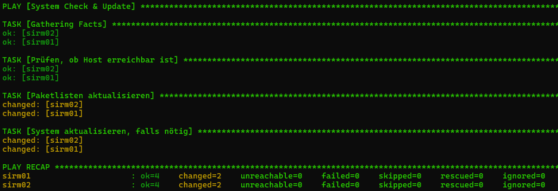
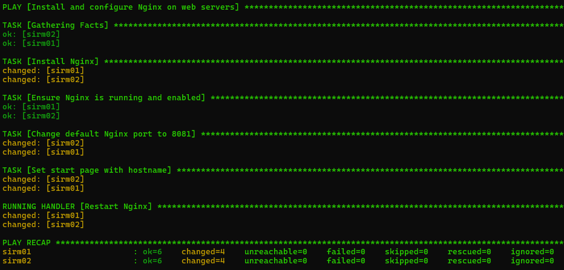
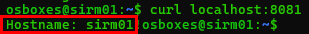
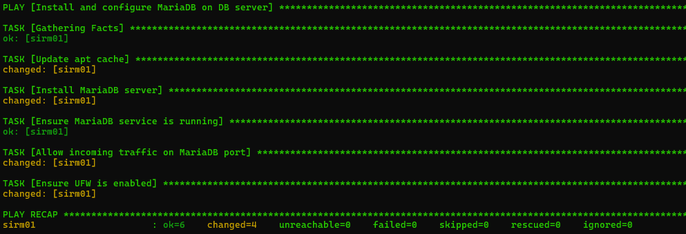
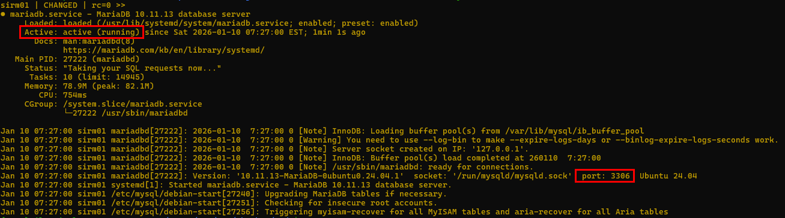
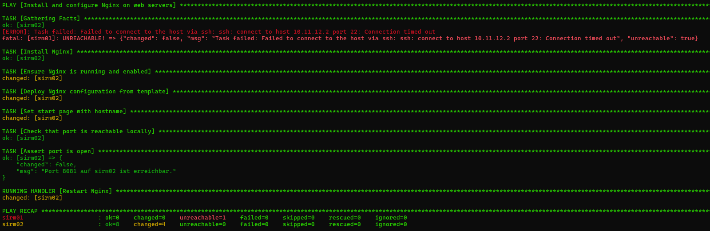

# Aufgabe 3a

**Konfigurieren Sie die virtuellen Maschinen aus Aufgabe 1 mit Ansible. Verwenden Sie hierfür folgende Vorgaben:**
- Erstellen Sie eine ansible.cfg. Erläutern Sie, welche Standardkonfiguration sie hier sinnvollerweise setzen sollten.
  - [ansible.cfg](code/ansible.cfg)
  ````ansible.cfg
  [defaults]
  inventory = ./hosts.yml           // Legt die Inventory Datei fest
  remote_user = osboxes             // Benutzer, mit dem sich per SSH verbunden wird
  host_key_checking = False         // SSH fragt, ob man sich verbinden möchte. Das wird so übersprungen
  interpreter_python = auto_silent  // Unterdrückt die Meldungen, dass Python automatisch gefunden wurd

  [privilege_escalation]
  become = True                     // Jeder Task läuft über sudo, wenn nicht anders definiert
  become_method = sudo              // Wie Ansible root-Rechte bekommen soll
  ````
- Erstellen Sie eine Inventory Datei und gruppieren Sie ihre Maschinen so, wie sie es für sinnvoll erachten.
  - [hosts.yml](code/hosts.yml)
  ````yaml
  all:
  hosts:
    sirm01:
      ansible_host: 10.11.12.2
    sirm02:
      ansible_host: 10.11.12.3

  children:
    webservers:
      hosts:
        sirm01:
        sirm02:
      vars:
        http_port: 8081

    dbservers:
      hosts:
        sirm01:
      vars:
        db_port: 3306  
  ````
  - Test mit `ansible all -m ping`: <br>
  
- Schreiben Sie ein Playbook, das zeigt, dass alle Maschinen erreichbar sind und das System aktuell ist bzw. aktualisiert, wenn es nicht aktuell ist.
  - [system_check.yml](code/playbooks/system_check.yml)
  ````yaml
  ---
  - name: System Check & Update
    hosts: all
    become: yes
    gather_facts: yes

    tasks:

    - name: Prüfen, ob Host erreichbar ist
      ping:

    - name: Paketlisten aktualisieren
      apt:
      update_cache: yes
      register: update_result

    - name: System aktualisieren, falls nötig
      apt:
      upgrade: dist
      autoremove: yes
      when: update_result is changed

    ````
  - Testen mit `ansible-playbook playbooks/system_check.yml`:<br>
  
- Schreiben Sie ein Playbook, das jeweils Nginx auf den VMs web01 und web02 installiert und über Port 8081 erreichbar ist. Lassen sie auf der Startseite den Namen ihrer VM ausgeben.
  - [nginx_install.yml](code/playbooks/nginx_install.yml)
  ````yaml
  ---
  - name: Install and configure Nginx on web servers
    hosts: webservers
    become: yes
    gather_facts: yes

    tasks:

    - name: Install Nginx
      apt:
      name: nginx
      state: present
      update_cache: yes

    - name: Ensure Nginx is running and enabled
      service:
      name: nginx
      state: started
      enabled: yes

    - name: Change default Nginx port to 8081
      lineinfile:
      path: /etc/nginx/sites-available/default
      regexp: '^\s*listen\s+80'
      line: "        listen {{ http_port }};"
      backrefs: yes
      notify: Restart Nginx

    - name: Set start page with hostname
      copy:
      dest: /var/www/html/index.html
      content: "Hostname: {{ inventory_hostname }}!"

    handlers:
    - name: Restart Nginx
      service:
      name: nginx
      state: restarted
    ````
  - Testen mit `ansible-playbook playbooks/nginx_install.yml`:<br>
  
  - Webserver erreichbar und Hostname wird angezeigt: <br>
  
- Es soll mittels eines Playbooks MariaDB auf der VM db01 installiert werden. Der Port 3306 soll freigegeben werden
  - [mariadb_install.yml](code/playbooks/mariadb_install.yml)
  ````yaml
  ---
  - name: Install and configure MariaDB on DB server
    hosts: dbservers
    become: yes
    gather_facts: yes

    tasks:

    - name: Update apt cache
      apt:
      update_cache: yes

    - name: Install MariaDB server
      apt:
      name: mariadb-server
      state: present

    - name: Ensure MariaDB service is running
      service:
      name: mariadb
      state: started
      enabled: yes

    - name: Allow incoming traffic on MariaDB port
      ufw:
      rule: allow
      port: "{{ db_port }}"
      proto: tcp

    - name: Ensure UFW is enabled
      ufw:
      state: enabled
    ````
  - Testen mit `ansible-playbook playbooks/mariadb_install.yml`:<br>
  
  - MariaDB erreichbar und Port freigegeben: `ansible dbservers -m shell -a "systemctl status mariadb"` <br>
  


# Aufgabe 3b

**Ansible ermöglicht die Verwendung von Templates auf Basis von Jinja2.**
- Erläutern Sie, was solche Templates sind, und wozu und in welcher Weise Templates in Ansible genutzt werden können.
  - Templates sind eine Art Textvorlagen mit Platzhaltern und Logik, die beim Ausführen dynamisch mit Daten gefüllt werden.
  - Inhalt ist eine Konfigurationsdatei, die um Logik-Elemente erweitert wurde.
  - Sie können für Skripte, Configs für Services, Environment-Files und weiteres benutzt werden.
  - Vorteil gegenüber Variablen ist, dass ganze Dateien generiert werden können statt einzelne Zeilen austuschen zu müssen. 

**Verwendung von Jinja2-Templates.**
- Sorgen Sie dafür, dass mittels Templates der Port der Konfiguration über eine Variable im Playbook frei wählbar ist.
  - [port_nginx.j2](code/templates/port_nginx.j2)
  ````jinja2
  server {
    listen {{ http_port }};
    root /var/www/html;
    index index.html;
  }  
  ````
- Überprüfen Sie mittels Ansible assert, ob die Maschinen über den entsprechenden Port 8081 erreichbar sind
  - Abändern des Playbooks `nginx_install.yml` in neuer Datei: [nginx_install_with_template.yml](code/playbooks/nginx_install_with_template.yml)
  ````yaml
  ---
  - name: Install and configure Nginx on web servers
    hosts: webservers
    become: yes
    gather_facts: yes

    tasks:

    - name: Install Nginx
      apt:
      name: nginx
      state: present
      update_cache: yes

    - name: Ensure Nginx is running and enabled
      service:
      name: nginx
      state: started
      enabled: yes

    - name: Deploy Nginx configuration from template
      template:
      src: ../templates/port_nginx.j2
      dest: /etc/nginx/sites-available/default
      notify: Restart Nginx

    - name: Set start page with hostname
      copy:
      dest: /var/www/html/index.html
      content: "Willkommen auf {{ inventory_hostname }}!"

    - name: Check that port is reachable locally
      wait_for:
      host: 127.0.0.1
      port: "{{ http_port }}"
      timeout: 5
      register: port_check

    - name: Assert port is open
      assert:
      that:
      - port_check is succeeded
      fail_msg: "Port {{ http_port }} auf {{ inventory_hostname }} ist nicht erreichbar!"
      success_msg: "Port {{ http_port }} auf {{ inventory_hostname }} ist erreichbar."

    handlers:
    - name: Restart Nginx
      service:
      name: nginx
      state: restarted
    ````
  - Testen mit `ansible-playbook playbooks/nginx_install_with_template.yml`:<br>
  - Anmerkung: SSH funktioniert scheinbar auf der ersten VM nicht mehr, ohne Änderungen vorgenommen zu haben.
  
  - Über Assert ist zu sehen, dass der Port erreichbar ist.
